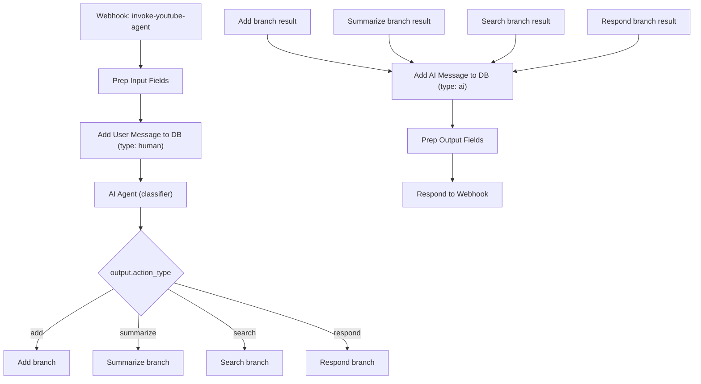
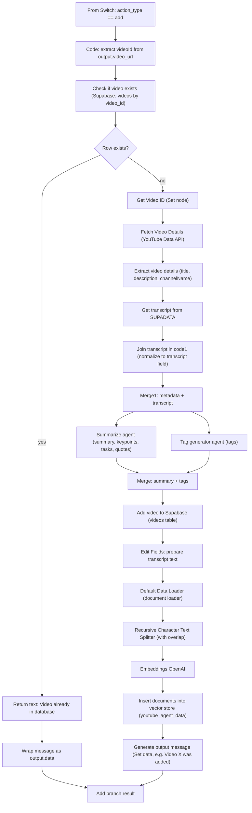
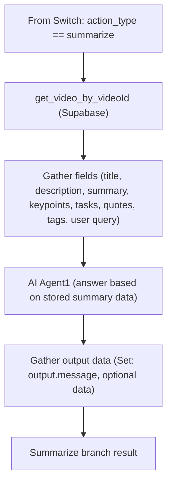
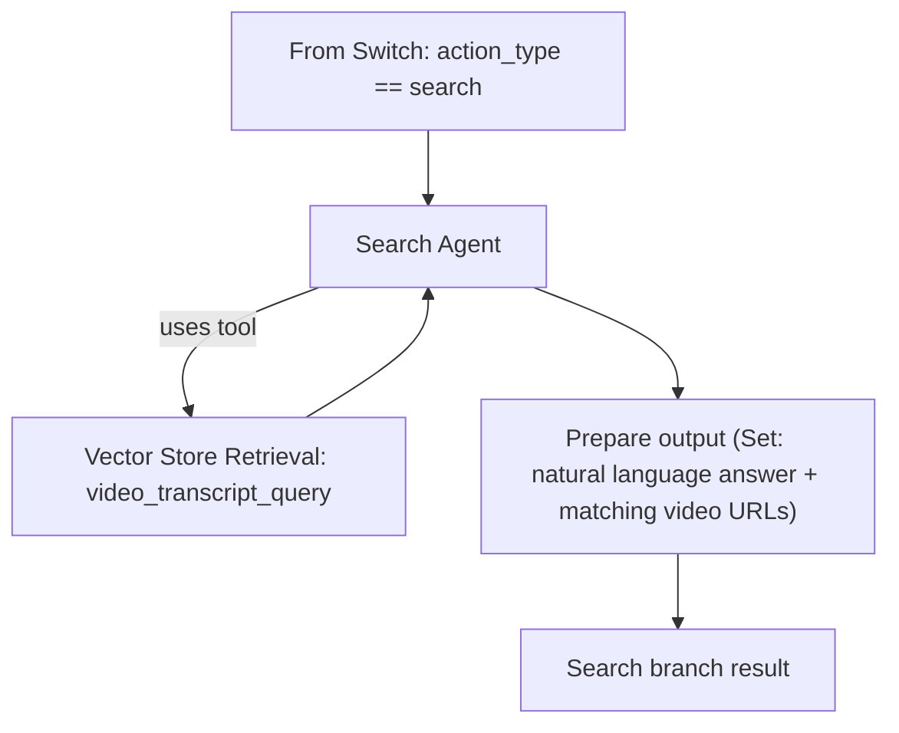
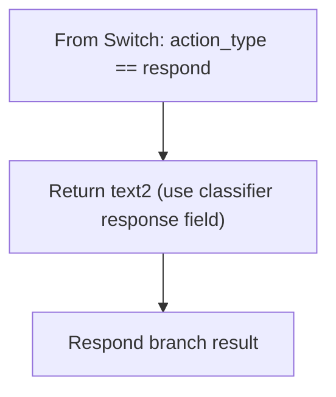
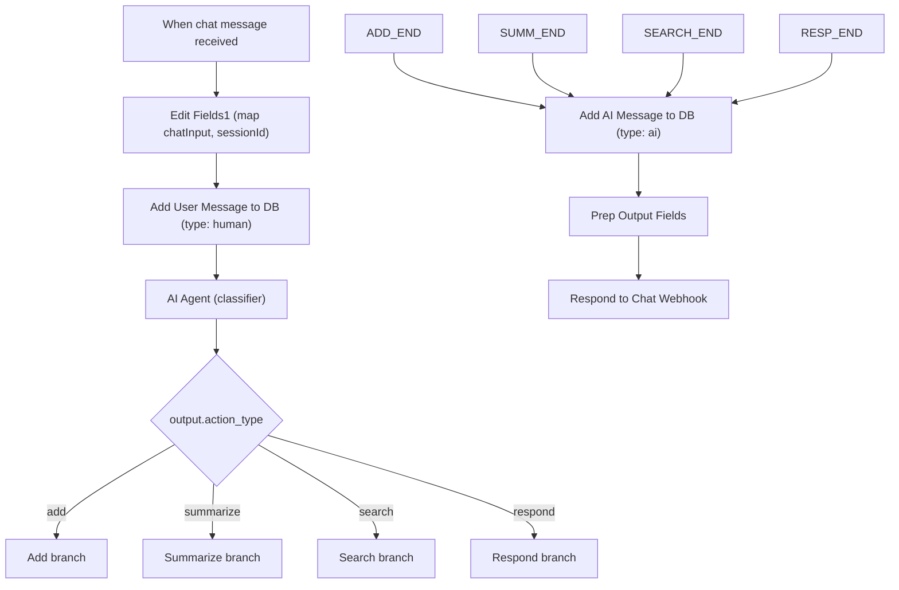

# YouTube Agent – n8n Workflow Documentation  

## 1. Overview  

**Purpose**  
The *YouTube Agent* workflow provides a conversational interface for interacting with YouTube videos. It can:  

| Action | Description |
|--------|-------------|
| **Add** | Store a new YouTube video (metadata, transcript, summary, tags) in a Supabase database and vector store. |
| **Summarize** | Return a generated summary, key‑points, actionable tasks and quotes for a video that already exists in the database. |
| **Search** | Perform a semantic search over previously stored video transcripts and return matching video URLs. |
| **Respond** | Answer user queries directly when the LLM determines a direct response is appropriate. |

**Problem solved**  

- Centralises video knowledge (metadata + transcript + semantic embeddings) in a single DB.  
- Enables a chat‑style UI (webhook or chat‑trigger) that understands natural language commands and routes them to the correct backend operation.  

## 2. Triggers & Entry Points  

| Trigger Node | Path / Event | Primary Use |
|--------------|--------------|-------------|
| **Webhook** (`invoke‑youtube‑agent`) | `POST /invoke-youtube-agent` (header‑auth) | External HTTP callers (e.g., a front‑end) send `{user_id, session_id, request_id, query}`. |
| **When chat message received** | Internal n8n chat webhook (`a023c538‑…`) | Handles chat‑style messages from the n8n UI (`sessionId`, `chatInput`). |

Both triggers feed into **Prep Input Fields** (or **Edit Fields1** for the chat trigger) which normalises the payload.  

## 3. Inputs & Outputs  

### 3.1. Input Payload (Webhook)  

```json
{
  "user_id": "<string>",
  "session_id": "<string>",
  "request_id": "<string>",
  "query": "<natural‑language command>"
}
```

### 3.2. Output (Webhook response)  

The workflow always ends with **Respond to Webhook**. The response body is built by **Prep Output Fields** (or the branch‑specific *Return text* nodes) and has the shape:

```json
{
  "success": true,
  "message": {
    "content": "<string>"   // human‑readable reply from the AI or status message
  }
}
```

When a video is added, an additional `data` field is set by **Generate output message** (e.g., “The video ‘…’ by … was added successfully!”).  

## 4. Node‑by‑Node Flow  

Below is a linear description of the main execution path. Branches are noted where the **Switch** node diverges.

| # | Node (type) | Key Function | Important Data Transformations |
|---|--------------|--------------|--------------------------------|
| 1 | **Webhook** (webhook) | Receives HTTP request, validates header auth. | Passes raw JSON body downstream. |
| 2 | **Prep Input Fields** (set) | Extracts `query`, `user_id`, `request_id`, `session_id` into top‑level fields. | `query`, `session_id` used later for DB writes and LLM prompt. |
| 3 | **Add User Message to DB** (supabase) | Inserts a *human* message into `messages` table (`type: "human"`). | Stores `{session_id, message:{type:"human",content:$json.query}}`. |
| 4 | **AI Agent** (langchain agent) | Calls **Anthropic Chat Model** (`claude‑3‑5‑haiku‑20241022`) with a system prompt that classifies the user request into an *action_type* (`add|summarize|search|respond`). The agent also has an **output parser** (**Structured Output Parser**) that forces JSON output. | Output JSON stored in `$json.output`. |
| 5 | **Switch** (base.switch) | Routes based on `$json.output.action_type`. Four branches: `add`, `summarize`, `search`, `respond`. |
| **Add** branch | | | |
| 5a | **Code** (code) | Extracts YouTube video ID from `output.video_url` using regex patterns. | Returns `{videoId}`. |
| 5b | **Check if video exists** (httpRequest) | Queries Supabase `videos` table for the extracted `video_id`. | Returns `{id}` if present. |
| 5c | **If row exists** (if) | *True* → **Return text** (status “already in DB”). *False* → **Get Video ID** (set). |
| 5d‑True | **Return text** (code) | Builds a simple message `"The video with the id … is already in the database."` |
| 5d‑False | **Get Video ID** (set) | Stores `videoId` for later steps. |
| 5e | **Fetch Video Details** (httpRequest – YouTube OAuth2) | Calls YouTube Data API `videos?part=snippet&id=…` to get title, description, channel. |
| 5f | **Extract video details** (set) | Maps API response to `title`, `description`, `channelName`. |
| 5g | **Get transcript from SUPADATA** (httpRequest) | Calls external transcript service (`api.supadata.ai`) with the video ID. |
| 5h | **Join transcript in code1** (code) | Normalises transcript payload (`content → transcript`). |
| 5i | **Merge1** (merge) | Combines video metadata and transcript into a single item. |
| 5j | **Summarize agent** (langchain agent) | Generates a structured summary (`summary`, `keypoints`, `actionable‑tasks`, `extracted‑quotes`). |
| 5k | **Tag generator agent** (langchain agent) | Generates a list of tags (`tags`). |
| 5l | **Merge** (merge) | Merges summary and tags into one object. |
| 5m | **Add video to supabase** (supabase) | Inserts a new row into `videos` table with all fields (metadata, transcript, summary, tags, etc.). |
| 5n | **Edit Fields** (set) | Prepares the transcript text for embedding (`data`). |
| 5o | **Default Data Loader** (langchain document loader) | Wraps transcript text as a document for vectorisation. |
| 5p | **Recursive Character Text Splitter** (langchain) | Splits transcript into chunks (overlap = 100). |
| 5q | **Embeddings OpenAI** (langchain embedding) | Generates embeddings for each chunk via OpenAI. |
| 5r | **Insert documents** (vectorStoreSupabase) | Stores embeddings in Supabase vector store (`youtube_agent_data`). |
| 5s | **Generate output message** (set) | Creates a friendly success message (`data`). |
| 5t | **Add AI Message to DB** (supabase) | Inserts an *AI* message (`type:"ai"`) with `content` = `$json.output` (or the success message). |
| 5u | **Prep Output Fields** (set) | Normalises final webhook response (`success:true`, `message.content`). |
| 5v | **Respond to Webhook** (respond) | Sends HTTP response back to caller. |
| **Summarize** branch | | | |
| 5a‑Summ | **Code1** (code) | Retrieves stored video record (`Supabase` → `videos` table) based on `video_id` extracted earlier. |
| 5b‑Summ | **Gather fields** (set) | Pulls stored fields (title, description, summary, etc.) plus original user query. |
| 5c‑Summ | **AI Agent1** (langchain agent) | Uses a system prompt that builds a direct answer from the stored summary data. |
| 5d‑Summ | **Gather output data** (set) | Captures the LLM answer (`output`). |
| 5e‑Summ | **Add AI Message to DB** → **Prep Output Fields** → **Respond to Webhook** (same as Add branch). |
| **Search** branch | | | |
| 5a‑Search | **Search Agent** (langchain agent) | Generates a natural‑language answer and a list of matching video URLs using the vector store. |
| 5b‑Search | **Prepare output** (set) | Wraps the answer for webhook response. |
| 5c‑Search | **Add AI Message to DB** → **Prep Output Fields** → **Respond to Webhook**. |
| **Respond** branch | | | |
| 5a‑Respond | **Return text2** (code) | Returns the `response` field from the classifier output directly. |
| 5b‑Respond | **Add AI Message to DB** → **Prep Output Fields** → **Respond to Webhook**. |

*The *When chat message received* trigger follows the same logical path, but uses **Edit Fields1** instead of **Prep Input Fields** to map `sessionId` and `chatInput`. The rest of the flow is identical.*

## 5. Control Flow & Logic  

| Construct | Description |
|-----------|-------------|
| **Switch** (`c9da7f1c…`) | Evaluates `$json.output.action_type`. Four mutually exclusive branches (`add`, `summarize`, `search`, `respond`). |
| **If row exists** (`64a39e6a…`) | Checks whether a video with the same `video_id` already exists. If true, short‑circuits to a “already stored” message; otherwise proceeds with full ingestion pipeline. |
| **Code nodes** (`b2aa2686…`, `f6eddd1e…`, etc.) | Perform custom JavaScript: video‑ID extraction, transcript URL parsing, success/error handling. Errors are returned as `{success:false,error:"…"};` downstream nodes can react (currently only logged). |
| **Memory Buffer Window** (`f017e258…`) | Provides a sliding‑window chat memory to the LLMs (used by both **AI Agent** and **AI Agent1**). |
| **Vector Store Retrieval** (`e8a4ab94…`) | Exposes a tool (`video_transcript_query`) to the **Search Agent** for semantic retrieval. |
| **Retry / Error handling** | Not explicitly configured; default n8n retry policy (3 attempts, exponential back‑off) applies to all HTTP and database nodes. Custom error messages are generated in the *Extract transcript url* and *Return text* code nodes. |

## 6. External Integrations  

| Integration | Nodes | Credentials (as defined in the workflow) |
|-------------|-------|------------------------------------------|
| **Supabase (DB & Vector Store)** | `Add User Message to DB`, `Add AI Message to DB`, `Add video to supabase`, `Check if video exists`, `Supabase`, `Insert documents`, `Supabase Vector Store`, `get_video_by_videoId` | `Prod Supabase account` (ID `hOLIm3Jeg9JcG616`) – full read/write. |
| **Anthropic Claude** | `Anthropic Chat Model` (LLM) | `Anthropic account` (ID `AiDvkdxUFBeRQmnE`). |
| **OpenAI Embeddings** | `Embeddings OpenAI` | `Backup OpenAI Account` (ID `xAeHxzxTT16sMdwS`). |
| **YouTube Data API (OAuth2)** | `Fetch Video Details` | `YouTube account` (ID `zqTrwRG8dQ1p3VEE`). |
| **Supadata Transcript API** | `Get transcript from SUPADATA` | API key passed via header (`x-api-key`). |
| **Header Auth for Webhook** | `Webhook` | `Header Auth account` (ID `o5akNgXQQR74Sezh`). |
| **Optional HTTP requests** | `Get video page`, `Fetch transcript`, `XML` | No credentials (public URLs). |

## 7. Error Handling & Retries  

| Node | Failure Mode | Current Handling |
|------|--------------|------------------|
| **Extract transcript url** (code) | Unable to locate captions → returns `{success:false,error:"…"}.` | Downstream nodes do not explicitly branch on `success:false`; the workflow will still attempt to continue, potentially causing later failures. |
| **HTTP Request** nodes | Network / API errors | n8n default retry (3 attempts, 10 s back‑off). |
| **Supabase queries** | Row not found / permission errors | Errors bubble up; the **If row exists** node only checks for existence (`id` field). |
| **LLM nodes** | Model throttling / token limits | Default n8n retry; no custom fallback. |
| **Switch** | Unexpected `action_type` | No matching case → workflow ends without a response (potential timeout). |

*Recommendation*: Add an **Error** branch after the **Switch** to return a generic “I could not understand your request.” message.

## 8. Configuration & Deployment Notes  

| Item | Details |
|------|---------|
| **Workflow ID** | `V4svhdBC0oiQmCND` (active). |
| **Execution order** | `v1` (default linear order). |
| **Environment variables** | None defined; all secrets are stored in credential objects. |
| **Deploy** | Export the JSON and import into an n8n instance with the required credentials (Supabase, Anthropic, OpenAI, YouTube OAuth2, Header Auth). |
| **Scaling** | Stateless HTTP webhook; can be run behind a load balancer. Vector store and DB are external services, so horizontal scaling of n8n workers is safe. |
| **Versioning** | The workflow version ID is `901bdc0a-bc67-46bc-b805-0e708d3be938`. Increment on changes. |

## 9. Security & Data Protection  

| Concern | Mitigation |
|---------|------------|
| **Authentication** | Webhook protected by **Header Auth** – ensure the secret header is kept confidential. |
| **Supabase credentials** | Stored in n8n credential store; restrict access to the n8n environment. |
| **User data** | Only `user_id`, `session_id`, `request_id`, and the query are stored in the `messages` table. No personally identifiable data is persisted beyond that. |
| **External API keys** | Supadata API key is passed in a header; keep the key secret and rotate regularly. |
| **LLM prompts** | System prompts contain no sensitive data. |
| **Data at rest** | Supabase provides encrypted storage; ensure the project enforces TLS for all connections. |
| **GDPR / privacy** | If storing user identifiers, implement a deletion endpoint that removes rows from `messages` and `videos` for a given `user_id`. |

## 10. Limitations & Extension Points  

| Limitation | Suggested Extension |
|------------|---------------------|
| **No fallback for unknown `action_type`** | Add an *else* branch after the Switch that returns a generic clarification request. |
| **Transcript extraction fragile** (relies on HTML parsing) | Replace the custom code with the official YouTube Captions API or a more robust library. |
| **Single‑LLM model** (Anthropic) | Parameterise the LLM node to allow swapping between Claude, GPT‑4, etc., via workflow variables. |
| **No rate‑limit handling for Supadata** | Implement a retry‑with‑back‑off or circuit‑breaker around the transcript request. |
| **No pagination for search results** | Extend **Search Agent** to return a limited set and include a “show more” token. |
| **Hard‑coded YouTube API key placeholder** | Store the API key in an environment variable and reference it via `{{$env.YOUTUBE_API_KEY}}`. |
| **No explicit logging** | Add **Set** nodes that write to a logging table or external observability service (e.g., Sentry). |

## 11. Visual Diagrams  

### 11.1 Main Flow (Webhook + Branch Overview)



This diagram is a high level router: the detailed logic of each branch is in the next diagrams.

---

### 11.2 Add Branch (Full Ingestion + Embedding Pipeline)



`ADD_END` is the same node that feeds into the shared tail in 11.1.

---

### 11.3 Summarize Branch (Use Stored Video Data)



`SUMM_END` connects back to `Add AI Message to DB` in the main diagram.

---

### 11.4 Search Branch (Vector Store Retrieval)



The Search Agent uses the `video_transcript_query` tool backed by the Supabase vector store. `SEARCH_END` joins the shared tail.

---

### 11.5 Respond Branch (Direct LLM Answer)



`RESP_END` again joins the shared tail: Add AI Message to DB, Prep Output Fields, Respond to Webhook.

---

### 11.6 Chat Trigger Variant (n8n Chat UI)



This reflects that the chat trigger differs only in how it maps the incoming payload; once `sessionId` and `chatInput` are normalized, the control flow is identical.
