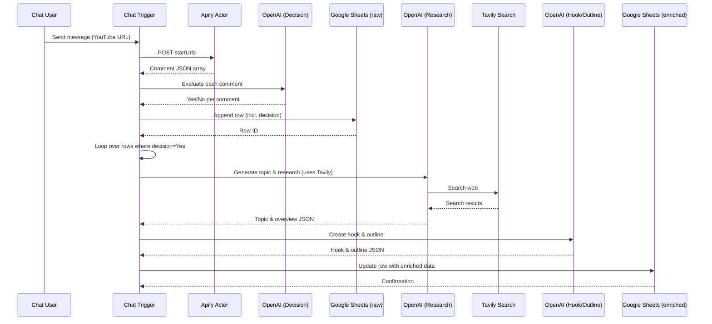

# YouTube Content Idea Generator  

## 1. Overview

This workflow automates the discovery of YouTube video ideas from viewer comments. It works by:

1. Receives a chat message containing a YouTube video URL (or any string that can be used as a start URL).  
2. Scrapes the comments of that video via an Apify actor.  
3. Uses **OpenAI (gpt‑4.1‑mini)** to evaluate each comment and decide whether it represents a viable content idea for Nolan Harper’s AI‑automation channel.  
4. Stores the raw comment data and the “Yes/No” decision in a Google Sheet.  
5. For every comment flagged **Yes**, the workflow:  
   * Generates a research‑backed topic and overview (via a second OpenAI call that invokes the **Tavily** web‑search tool).  
   * Turns the research into a hook and outline (third OpenAI call).  
   * Writes the enriched data (topic, research, hook, outline) back to the same Google Sheet.  

The result is a continuously‑updated spreadsheet of comment‑driven video ideas, each enriched with research, a hook, and a structured outline ready for production.  

## 2. Triggers and Entry Points  

| Node | Trigger Type | Description |
|------|--------------|-------------|
| **When chat message received** (`@n8n/n8n-nodes-langchain.chatTrigger`) | Webhook / chat‑message trigger | Fires when a chat message arrives (e.g., from a Slack/Discord bot). The message payload is expected to contain a YouTube video URL or a search term that will be used as `{{ $json.chatInput }}`. |

*The webhook ID is `a3b75c51-c5a8-44cc-b116-8ac9ac5b67bd`.*  

## 3. Inputs and Outputs  

| Step | Input (source) | Output (target) | Data Shape |
|------|----------------|----------------|------------|
| Chat trigger | User message (`chatInput`) | HTTP Request body (`startUrls`) | String (URL) |
| HTTP Request (Apify) | `startUrls` from chat | JSON array of comment objects (`id`, `text`, `type`, `likeCount`, `replyCount`, `publishedTime`, `author`) | Array of objects |
| OpenAI (first) | Each comment (`$json.text`) | Decision JSON (`choices[0].message.content.output` = “Yes” or “No”) | `{ output: "Yes" }` |
| Filter | Decision JSON | Passes only items where output = “Yes” | Same as input |
| Google Sheets1 (appendOrUpdate) | Comment data + decision | Row in **YouTube Comments** sheet | Columns: `id`, `contentIdea`, `text`, `type`, `likeCount`, `replyCount`, `publishedTime`, `author` |
| Loop Over Items | Rows from Google Sheets1 (only “Yes” rows) | Individual item for downstream processing | Same as row JSON |
| OpenAI2 (research) | Comment text (`$json.text`) | JSON `{ topic, research_overview }` | Structured JSON |
| OpenAI1 (hook + outline) | Output of OpenAI2 (`topic`, `research_overview`) | JSON `{ hook, outline }` | Structured JSON |
| Google Sheets (update) | Enriched data (topic, research, hook, outline) | Updated row in the same sheet (matched on `id`) | Columns: `topic`, `research`, `hook`, `outline` |

## 4. Node‑by‑Node Flow  

| # | Node (ID) | Type | Key Parameters | Purpose |
|---|-----------|------|----------------|---------|
| 1 | **When chat message received** (`f756a3a4…`) | `@n8n/n8n-nodes-langchain.chatTrigger` | No custom options | Starts the workflow when a chat message arrives. |
| 2 | **HTTP Request** (`6d3ba1aa…`) | `n8n-nodes-base.httpRequest` | POST to `https://api.apify.com/v2/acts/mExYO4A2k9976zMfA/run-sync-get-dataset-items` Headers: `Accept: application/json`, `Authorization: Bearer <Apify‑token>` Body JSON includes `startUrls: ["{{ $json.chatInput }}"]` | Calls an Apify actor that scrapes YouTube comments for the supplied URL. |
| 3 | **OpenAI** (`9d033fd7…`) | `@n8n/n8n-nodes-langchain.openAi` | Model `gpt-4.1-mini` System prompt defines the “content‑idea decision” SOP. User prompt injects comment via `{{ $json.text }}` | Evaluates each comment and returns **“Yes”** if it can become a video idea, otherwise **“No”**. |
| 4 | **Filter** (`a744a4b5…`) | `n8n-nodes-base.filter` | Condition: `{{ $json.choices[0].message.content.output }} == "Yes"` | Allows only comments flagged as viable ideas to continue. |
| 5 | **Google Sheets1** (`aa0b700b…`) | `n8n-nodes-base.googleSheets` (appendOrUpdate) | Document ID & Sheet ID point to a Google Sheet titled **YouTube Comments**. Columns mapped: `id`, `contentIdea` (Yes/No), `text`, `type`, `likeCount`, `replyCount`, `publishedTime`, `author` | Persists raw comment data and the decision. |
| 6 | **Loop Over Items** (`9055b7f8…`) | `n8n-nodes-base.splitInBatches` | No custom options (default batch size = 1) | Iterates over each “Yes” row for further enrichment. |
| 7 | **OpenAI2** (`1aeef733…`) | `@n8n/n8n-nodes-langchain.openAi` | Model `gpt-4.1-mini` System prompt instructs the model to extract a **topic** and generate a **300‑500 word research overview**. Uses **Tavily** as an AI tool (see node 12). | Produces a research‑backed topic and overview for the comment. |
| 8 | **OpenAI1** (`12357e5b…`) | `@n8n/n8n-nodes-langchain.openAi` | Model `gpt-4.1-mini` System prompt asks for a **hook** and **outline** based on the topic & research. Outputs strict JSON `{ hook, outline }`. | Turns research into a ready‑to‑use video hook and outline. |
| 9 | **Google Sheets** (`1c81d413…`) | `n8n-nodes-base.googleSheets` (update) | Same spreadsheet as step 5. Columns updated: `topic`, `research`, `hook`, `outline` (matched on `id`). | Writes the enriched content back to the sheet. |
| 10 | **Tavily** (`e91b50db…`) | `@n8n/n8n-nodes-langchain.toolHttpRequest` | POST to `https://api.tavily.com/search` with Authorization header `Bearer tvly‑dev‑…`. Body contains placeholder `{searchTerm}` which is filled by OpenAI2 at runtime. | Provides real‑time web search results for the research generation step. |

## 5. Control Flow and Logic  

1. **Linear flow** from chat trigger → HTTP request → OpenAI decision → Filter → Google Sheets1.  
2. **Branch** after Google Sheets1: only rows with “Yes” are split into individual items (`Loop Over Items`).  
3. **Nested linear flow** for each item: OpenAI2 (research) → OpenAI1 (hook/outline) → Google Sheets (update).  
4. **Tool integration**: OpenAI2 calls the **Tavily** node as an AI tool (`ai_tool` connection). The tool’s output is injected into the LLM prompt automatically.  

**Combinatorial logic**: The filter uses a strict string equality (`Yes`). No other combinators are used.  

## 6. External Integrations  

| Service | Node | Authentication | Scope |
|---------|------|----------------|-------|
| **Apify** | HTTP Request | Bearer token (`apify_api_TZIb2yKKetN4gclE8oTTpB4tfKNEc4250Rs6`) | Scrapes YouTube comments. |
| **OpenAI** | OpenAI, OpenAI1, OpenAI2 | API key stored in credential `OpenAi account 3` (`LCQSyEofGMlre7us`) | LLM inference for decision, research, hook/outline. |
| **Google Sheets** | Google Sheets1, Google Sheets | OAuth2 (`Google Sheets account 2`) | Read/write to spreadsheet `1JoTrVYK7eEbh1Nx30B4s7u0urye_Sce5Zw2KFKolHlM`. |
| **Tavily** | Tavily | Bearer token (`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`) | Web search used by OpenAI2. |
| **n8n LangChain Trigger** | When chat message received | Internal webhook (no external auth) | Receives chat payload. |

## 7. Error Handling and Retries  

* The workflow does **not** define explicit error‑handling nodes (e.g., “Error Trigger” or “Retry”).  
* n8n’s default behavior: if a node fails, execution stops and the error is logged.  
* **Recommendation**: add “Error Workflow” nodes or enable “Continue On Fail” where appropriate (e.g., HTTP request to Apify, OpenAI calls) to avoid a single bad comment halting the entire pipeline.  

## 8. Configuration and Deployment Notes  

| Item | Details |
|------|---------|
| **Webhook URL** | Deploy the workflow and expose the generated webhook (`/webhook/a3b75c51-c5a8-44cc-b116-8ac9ac5b67bd`). |
| **API Keys** | Store Apify, OpenAI, and Tavily tokens in n8n credentials (never hard‑code). |
| **Google Sheet IDs** | Ensure the sheet IDs (`1JoTrVYK7eEbh1Nx30B4s7u0urye_Sce5Zw2KFKolHlM`) exist and the service account has edit rights. |
| **Batch Size** | `Loop Over Items` uses default batch size of 1; adjust if you want parallel processing (mind rate limits). |
| **Model Version** | All LLM calls use `gpt-4.1-mini`. Update if a newer model is preferred. |
| **Apify Actor** | Actor ID `mExYO4A2k9976zMfA` must be active and have permission to scrape YouTube comments. |
| **Execution Order** | Set to `v1` (default) – linear execution as defined by connections. |
| **Environment** | Works on any n8n instance (self‑hosted or n8n.cloud) with internet access. |

## 9. Security and Data Protection  

* **Secrets**: All bearer tokens and API keys are stored in n8n credential stores (encrypted at rest).  
* **Least Privilege**: The Google Sheets OAuth scope should be limited to the specific spreadsheet.  
* **Data Retention**: Comment data and generated ideas are persisted in the Google Sheet; consider GDPR/CCPA compliance if personal data (author names) are stored.  
* **Transport Security**: All external calls use HTTPS.  
* **Webhook Exposure**: The chat trigger webhook should be protected (e.g., IP whitelist or secret token) if exposed publicly.  

## 10. Limitations and Extension Points  

| Limitation | Explanation |
|------------|-------------|
| **Rate limits** | OpenAI, Apify, and Tavily each have request quotas; high comment volumes may hit limits. |
| **Single‑comment input** | The trigger expects a single URL/text; batch processing of multiple URLs would need a wrapper node. |
| **No fallback for “No” comments** | Currently discarded after the filter; you could store them for analytics. |
| **Static prompts** | Prompts are hard‑coded; moving them to workflow parameters would make the system more flexible. |
| **No parallelism** | Loop processes items sequentially; can be parallelized by increasing batch size and handling concurrency limits. |
| **Research depth** | Tavily is limited to 1 result and 7‑day window; replace or augment with other search APIs for deeper research. |

**Possible extensions**  

* Add a **sentiment analysis** node before the decision step.  
* Store the raw Apify JSON response in a separate sheet for audit.  
* Integrate a **notification** (Slack/Discord) when a new “Yes” idea is added.  
* Use **OpenAI function calling** instead of manual JSON parsing for stricter output validation.  

## 11. Visual Diagrams  

### Flowchart (main execution path)

### Sequence Diagram (key component interactions)

