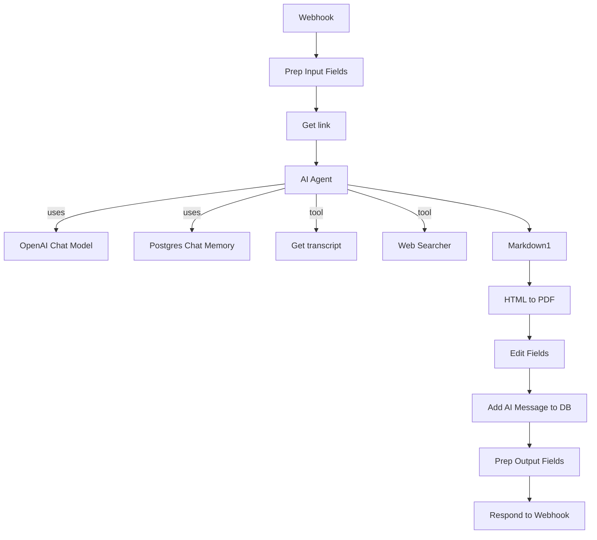
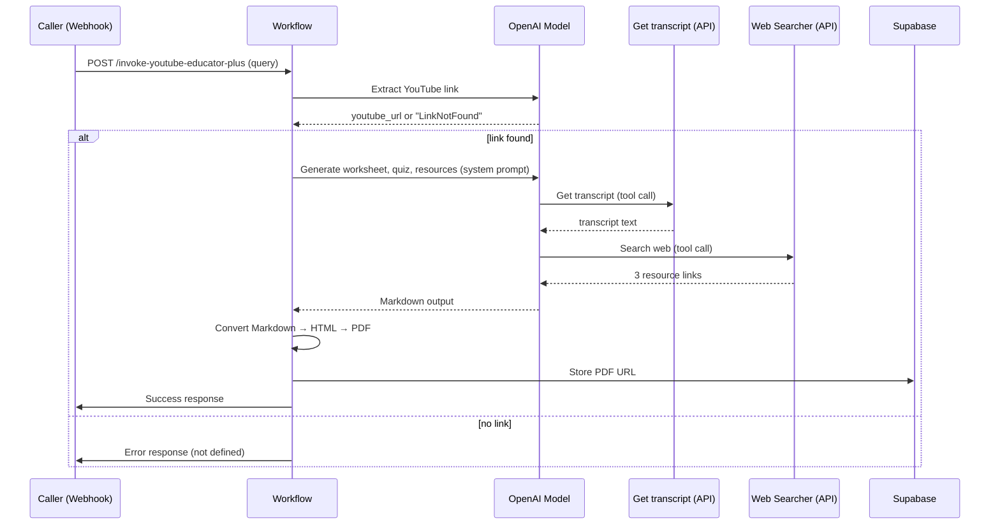

# YouTube Educator Plus Workflow Documentation  

---

## 1. Overview  

**Purpose** – This workflow receives a request (via an HTTP webhook) containing a user‑provided query that should include a YouTube video link. It then:  

1. Extracts the YouTube link from the free‑form query using an LLM.  
2. Retrieves the video transcript via the Supadata transcript API.  
3. Uses an LLM “AI Agent” equipped with two tools (YouTube transcript fetcher & Brave web‑search) to:  
   * Summarise the transcript into main ideas.  
   * Generate a fill‑in‑the‑blank worksheet, a quiz, and three supplemental resource links.  
4. Formats the result as Markdown, converts it to PDF, stores the PDF URL in Supabase, and finally returns a success response to the caller.  

**Problem solved** – Automates the creation of educational study material (worksheet + quiz + resources) from any YouTube video, removing the manual steps of transcript extraction, note‑taking, and resource curation.

---

## 2. Triggers and Entry Points  

| Node | Trigger Type | Details |
|------|--------------|---------|
| **Webhook** | HTTP **POST** endpoint `invoke-youtube-educator-plus` | Authenticated via a custom header (`Header Auth account`). Expects JSON body with fields `query`, `user_id`, `request_id`, `session_id`. |

The webhook is the sole entry point; every execution starts here.

---

## 3. Inputs and Outputs  

### 3.1 Expected Input (JSON body)  

| Field | Type | Description |
|-------|------|-------------|
| `query` | string | Free‑form user request that should contain a YouTube URL. |
| `user_id` | string | Identifier of the requesting user (passed through to downstream storage). |
| `request_id` | string | Correlation ID for tracing. |
| `session_id` | string | Session identifier used for chat memory persistence. |

### 3.2 Produced Output  

The workflow responds with **all incoming items** (the original webhook payload) plus an additional field `success: true` (added by **Prep Output Fields**). The response also includes a custom header `X-n8n-Signature` (empty value in the definition).  

> **Note** – The PDF URL is stored in Supabase but **not** returned directly in the webhook response. If downstream consumers need the URL they must query the Supabase table.

---

## 4. Node‑by‑Node Flow  

| # | Node (ID) | Type | Core Function | Key Parameters / Settings |
|---|-----------|------|----------------|----------------------------|
| 1 | **Webhook** (`a1468e31…`) | `webhook` | Receives POST request, authenticates via header. | Path: `invoke-youtube-educator-plus`; `responseMode: responseNode`. |
| 2 | **Prep Input Fields** (`224931a5…`) | `set` | Extracts fields from request body into flat variables. | Assigns `query`, `user_id`, `request_id`, `session_id`. |
| 3 | **Get link** (`906c53a6…`) | `langchain.openAi` | LLM call (GPT‑4o‑mini) that extracts **only** the YouTube URL from `query`. | Prompt: `Output the youtube link and only the youtube link in this message:{{ $json.query }}. If there is no youtube link then return "LinkNotFound"` |
| 4 | **AI Agent** (`1ab098fb…`) | `langchain.agent` | Orchestrates the main content generation using tools. | System message defines the step‑by‑step workflow (transcript → worksheet → quiz → resources). Uses two tools: **Get transcript** and **Web Searcher**. |
| 5 | **OpenAI Chat Model** (`c6c66bf0…`) | `langchain.lmChatOpenAi` | Language model used by the AI Agent for reasoning. | Model: default (via credentials). |
| 6 | **Postgres Chat Memory** (`d60219e0…`) | `langchain.memoryPostgresChat` | Persists chat history per `session_id` in Postgres table `messages`. | `sessionIdType: customKey`. |
| 7 | **Get transcript** (`63007a12…`) | `langchain.toolHttpRequest` | HTTP tool called by the AI Agent to fetch YouTube transcript. | URL: `https://api.supadata.ai/v1/youtube/transcript`; query param `url` = transcript tool input; header `x-api-key` = *Supadata API key*. |
| 8 | **Web Searcher** (`1021f80c…`) | `langchain.toolHttpRequest` | HTTP tool called by the AI Agent to search the web (Brave API). | URL: `https://api.search.brave.com/res/v1/web/search`; query param `q`; required headers (`Accept`, `Accept-Encoding`, `X-Subscription-Token`). |
| 9 | **Markdown1** (`a4715017…`) | `markdown` | Converts the AI Agent’s Markdown output to HTML (required for PDF conversion). | Mode: `markdownToHtml`; `completeHTMLDocument: true`. |
|10| **HTML to PDF** (`55fb3ce6…`) | `httpRequest` | Calls PDFEndpoint to render the HTML as a PDF file. | POST body includes `html` (from previous node) and margin settings. |
|11| **Edit Fields** (`216fd5f5…`) | `set` | Adds a friendly string containing the PDF URL to the data flow. | `PDF URL = "Here is a PDF version: {{ $json.data.url }}"`. |
|12| **Add AI Message to DB** (`4c92958f…`) | `supabase` | Inserts a record into Supabase table `messages` containing the PDF URL and session reference. | Fields: `session_id` (from Prep Input), `message` (JSON payload with `type: "ai"` and `content` = PDF URL). |
|13| **Prep Output Fields** (`414a4a3e…`) | `set` | Marks workflow as successful. | Sets `success = true`. |
|14| **Respond to Webhook** (`83c4ebd2…`) | `respondToWebhook` | Sends the final HTTP response back to the caller. | `respondWith: allIncomingItems`; adds header `X-n8n-Signature` (empty). |

**Data flow**: Webhook → Prep Input → Get link → AI Agent (uses OpenAI model, Postgres memory, transcript tool, web‑search tool) → Markdown → HTML‑to‑PDF → Edit Fields → Store in Supabase → Prep Output → Respond.

---

## 5. Control Flow and Logic  

1. **Linear execution** – Nodes are wired in a straight line; there are no conditional branches or loops defined in the workflow JSON.  
2. **AI Agent orchestration** – The agent follows the exact steps described in its system prompt (see node 4). The LLM decides when to call each tool; tool calls are routed via the `ai_tool` connections (`Get transcript`, `Web Searcher`).  
3. **Memory persistence** – Chat history for a given `session_id` is stored in Postgres (`Postgres Chat Memory`). This enables multi‑turn interactions if the workflow were to be invoked repeatedly with the same session.  
4. **Success flag** – After PDF generation and DB insertion, `Prep Output Fields` adds a boolean `success:true` which is included in the webhook response.  

> **[Inference]** No explicit error‑handling nodes are present; n8n’s default retry policy (3 attempts, exponential back‑off) applies to each node unless overridden at the workflow level.

---

## 6. External Integrations  

| Integration | Node(s) | Credential Type | Purpose |
|-------------|---------|-----------------|---------|
| **Header Auth** | Webhook | `httpHeaderAuth` | Secures the inbound webhook. |
| **OpenAI** | Get link, OpenAI Chat Model, AI Agent | `openAiApi` (Backup OpenAI Account) | Generates the YouTube link, drives the AI Agent reasoning. |
| **Supadata Transcript API** | Get transcript | No dedicated credential node (API key supplied as header value) | Retrieves full transcript of the target YouTube video. |
| **Brave Search API** | Web Searcher | No credential node (API key supplied as header value) | Finds three supplemental resource links. |
| **PDFEndpoint** | HTML to PDF | No credential node (Bearer token in header) | Renders Markdown‑derived HTML into a PDF file. |
| **Supabase** | Add AI Message to DB | `supabaseApi` (Studio Test) | Persists the PDF URL (and optional metadata) in the `messages` table. |
| **Postgres** | Postgres Chat Memory | `postgres` (Live Agent Studio Test) | Stores chat history for the session. |

---

## 7. Error Handling and Retries  

* The workflow does **not** define explicit error‑handling branches (e.g., “Error” nodes).  
* n8n’s built‑in retry mechanism will attempt each node up to **3 times** on failure, with a default back‑off.  
* If a node ultimately fails, the execution stops and the webhook response will contain the error payload (standard n8n behaviour).  

> **Recommendation** – Add “Error” workflow branches to capture failures from external APIs (e.g., transcript not found, PDF conversion error) and return a meaningful error message to the caller.

---

## 8. Configuration and Deployment Notes  

| Item | Detail |
|------|--------|
| **Webhook URL** | `https://<n8n-host>/webhook/invoke-youtube-educator-plus` (replace `<n8n-host>` with your deployment domain). |
| **Authentication** | Caller must include the custom header defined in the `Header Auth account` credential. |
| **API Keys Required** | • Supadata transcript API key (insert into `Get transcript` node header). • Brave Search API token (insert into `Web Searcher` node header). • PDFEndpoint bearer token (insert into `HTML to PDF` node header). |
| **Database Connections** | • Postgres credentials must point to a DB with a `messages` table (schema compatible with the memory node). • Supabase project must have a `messages` table with columns `session_id` (text) and `message` (json). |
| **Model Selection** | The “Get link” node uses `gpt-4o-mini`. The AI Agent uses the default model configured in the **OpenAI Chat Model** node (via the same credential). |
| **Execution Order** | Set to `v1` (default). No parallel branches, so order is deterministic. |
| **Versioning** | Workflow version ID: `87f3bc74-5271-49b2-a034-413727e49908`. Increment when making changes. |

---

## 9. Security and Data Protection  

| Concern | Mitigation |
|---------|------------|
| **Inbound authentication** | Header‑based auth enforced by the webhook node. |
| **API key exposure** | Keys are stored in n8n credentials (not in workflow JSON). Ensure credentials are encrypted at rest and limited to required scopes. |
| **User data** | `user_id`, `request_id`, and `session_id` are passed through to Supabase; ensure the Supabase table has appropriate row‑level security (RLS) to prevent unauthorized reads. |
| **PDF URL leakage** | PDF URLs are stored in Supabase and not returned in the webhook response; only authorized clients with DB access can retrieve them. |
| **OpenAI data** | Data sent to OpenAI (queries, transcript snippets) may be subject to OpenAI’s data usage policy. Use a dedicated OpenAI account with data retention disabled if required. |

---

## 10. Limitations and Extension Points  

| Limitation | Possible Extension |
|------------|--------------------|
| **Single‑turn only** – Workflow assumes one request per session; no follow‑up interactions are defined. | Add a loop or a second webhook that continues the conversation using the same `session_id`. |
| **Hard‑coded prompts** – System prompt in AI Agent is static. | Externalize the prompt to a separate “Set” node or a configuration file for easier updates. |
| **No fallback for missing YouTube link** – If `Get link` returns `LinkNotFound`, the downstream AI Agent will still run and likely fail. | Insert a conditional branch after “Get link” to return an error response when no link is found. |
| **PDF generation errors not captured** – Failure in PDFEndpoint aborts the workflow without a graceful message. | Add an error‑handling branch that catches HTTP request failures and returns a user‑friendly error. |
| **Hard‑coded API endpoints** – URLs are embedded in nodes. | Parameterise endpoints via workflow variables or environment variables for multi‑environment deployments. |

---

## 11. Visual Diagrams  

### 11.1 Main Execution Flow (Mermaid Flowchart)

### 11.2 Interaction Sequence (AI Agent & Tools)

--- 

*End of documentation.*