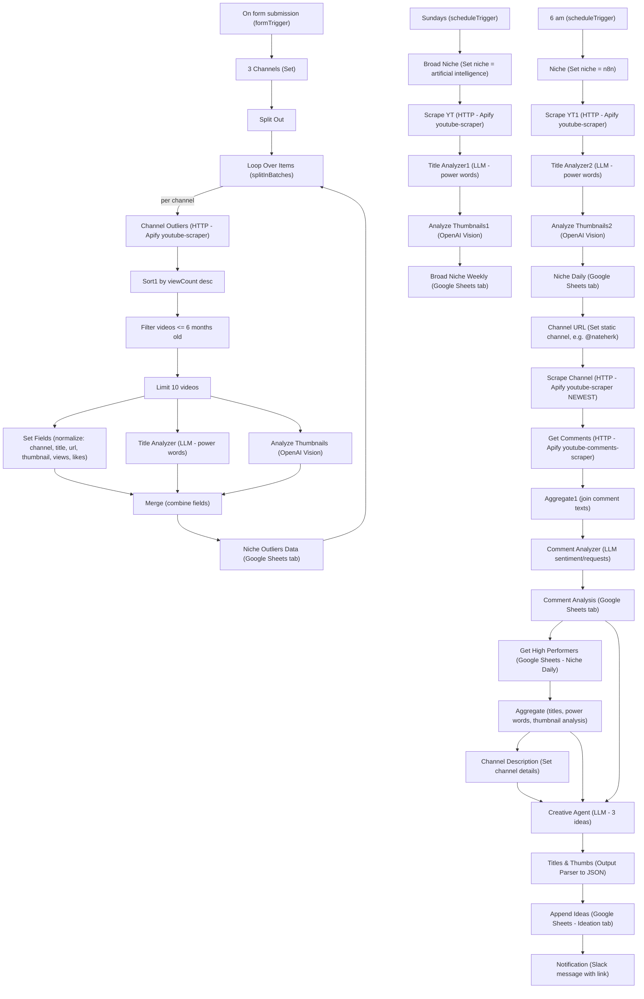
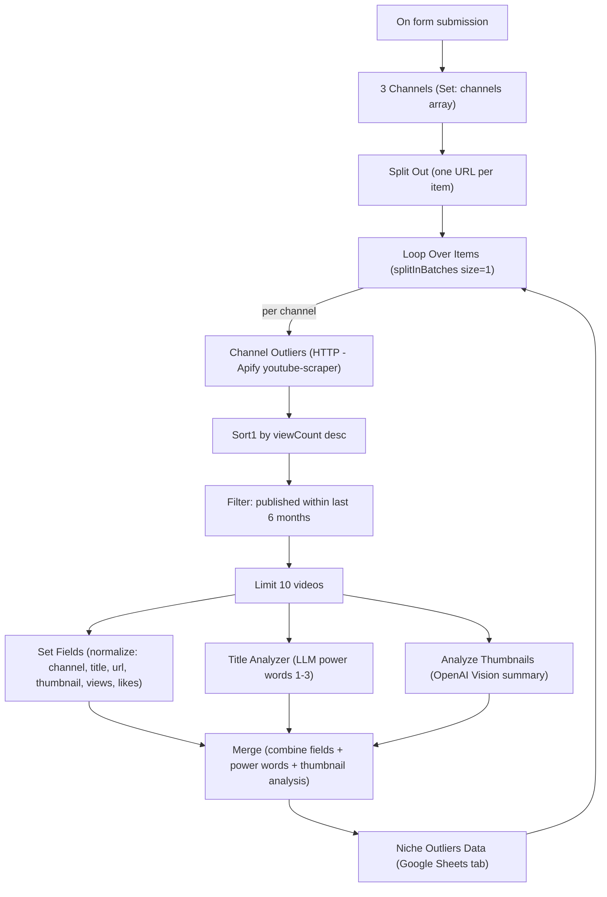
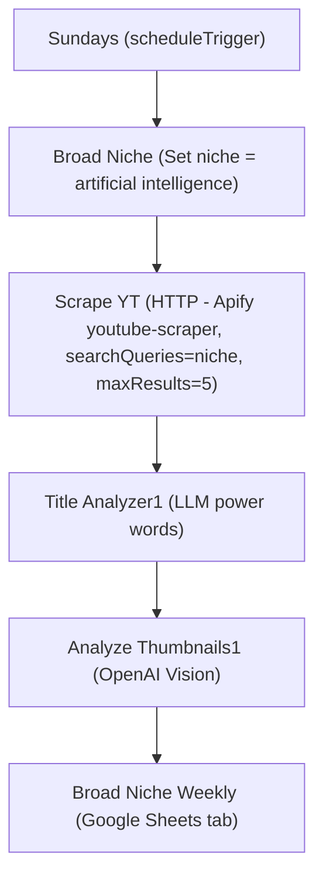
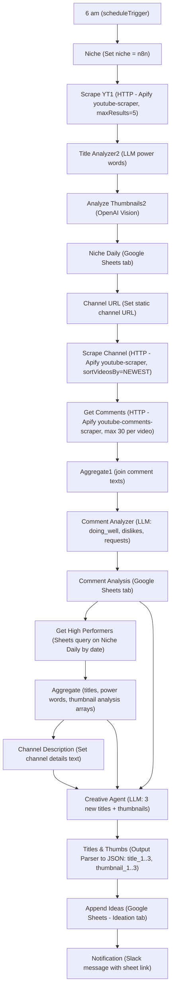

# YouTube Strategist Workflow Documentation  

## 1. Overview  

The **YouTube Strategist** workflow automates a full‑cycle YouTube content intelligence pipeline:  

| Phase | Goal |
|-------|------|
| **Phase 1 – Niche Outliers** | Accept three competitor channel URLs, scrape their top videos, extract power‑word titles and thumbnail insights, and store the results. |
| **Phase 2 – Broad Niche (Weekly)** | On Sundays, run a weekly scrape for a broad niche (e.g., “artificial intelligence”), analyse titles & thumbnails, and log the data. |
| **Phase 3 – Niche (Daily)** | At 6 am each day, run a daily scrape for a specific niche (e.g., “n8n”), analyse titles & thumbnails, and log the data. |
| **Phase 4 – Comment Analysis** | Pull recent comments from the selected channel, run a language‑model analysis to surface audience sentiment, and write the insights to a sheet. |
| **Phase 5 – Ideation** | Combine high‑performing video data, audience insights, and channel description; generate three fresh video title & thumbnail concepts; store them and notify Slack. |

The workflow solves the problem of **manual YouTube research** by:  

* Collecting performance data from competitor channels.  
* Extracting “power words” and thumbnail hooks via LLMs.  
* Summarising audience sentiment from comments.  
* Producing data‑driven content ideas ready for execution.  

## 2. Triggers & Entry Points  

| Trigger Node | Type | Schedule / Event | Output |
|--------------|------|------------------|--------|
| **On form submission** | `formTrigger` | User submits a form with three channel URLs (Channel 1‑3). | JSON with fields `Channel 1`, `Channel 2`, `Channel 3`. |
| **Sundays** | `scheduleTrigger` | Every Sunday (default timezone) | Starts **Broad Niche** branch. |
| **6 am** | `scheduleTrigger` | Daily at 06:00 | Starts **Niche (Daily)** branch. |

## 3. Inputs & Outputs  

| Node | Input (key fields) | Output (key fields) |
|------|-------------------|---------------------|
| **Form Trigger** | `Channel 1‑3` URLs (strings) | Same fields. |
| **3 Channels (Set)** | Form fields | `channels` – array of the three URLs. |
| **Split Out** | `channels` array | Individual channel URL per item. |
| **Loop Over Items** | Split‑out items | Batches of 1 (via `splitInBatches`). |
| **Channel Outliers (HTTP)** | `{{ $json.channels }}` (array) | Video objects: `title`, `url`, `thumbnailUrl`, `viewCount`, `likes`, `channelName`. |
| **Title Analyzer** (LangChain Agent) | `title` | `output` – array of 1‑3 power‑word strings. |
| **Analyze Thumbnails** (OpenAI Vision) | `thumbnailUrl` | `choices[0].message.content` – short thumbnail analysis. |
| **Merge** | `Set Fields`, `Title Analyzer`, `Analyze Thumbnails` | Combined record for Google Sheet. |
| **Niche Outliers Data** (Google Sheets) | Merged record | Row appended to *Niche Outliers* tab. |
| **Broad Niche / Niche (Daily) HTTP** | `niche` string (set node) | Same video fields as above. |
| **Title Analyzer 1‑2**, **Analyze Thumbnails 1‑2** | Same as above | Same outputs, written to *Broad Niche Weekly* and *Niche Daily* sheets. |
| **Scrape Channel** (HTTP) | `channel` URL (set node) | Channel video list (used for comment scraping). |
| **Get Comments** (HTTP) | `url` of a video | Array of comment objects (`comment`). |
| **Aggregate1** | `comment` field | `comment` array (joined). |
| **Comment Analyzer** (LangChain Agent) | Joined comments | Structured output (`doing_well`, `audience_dislikes`, `audience_requests`). |
| **Comment Analysis** (Google Sheets) | Structured output | Row appended to *Comment Analysis* tab. |
| **Get High Performers** (Google Sheets) | Date filter | Returns top‑performing rows for the day. |
| **Aggregate** | `Title`, `Power Words`, `Thumbnail Analysis` from high performers | Aggregated arrays for the creative prompt. |
| **Channel Description** (Set) | Hard‑coded description | `Channel Details`. |
| **Creative Agent** (LangChain Agent) | Aggregated titles, power words, thumbnail analysis, audience insights, channel description | Structured ideas (`title_1`, `thumbnail_1`, …). |
| **Titles & Thumbs** (Output Parser) | Agent raw text | Parsed JSON (`title_1` … `thumbnail_3`). |
| **Append Ideas** (Google Sheets) | Parsed ideas | Row appended to *Ideation* tab. |
| **Notification** (Slack) | Fixed message + link | Slack channel notification. |

## 4. Node‑by‑Node Flow  

| # | Node (Name) | Type | Purpose | Key Settings |
|---|--------------|------|---------|--------------|
| 1 | **On form submission** | `formTrigger` | Starts Phase 1 when a user submits three competitor URLs. | Form fields: *Channel 1‑3* (required). |
| 2 | **3 Channels** | `Set` | Packs the three URLs into an array `channels`. | `value = =[ "{{ $json['Channel 1'] }}", "{{ $json['Channel 2'] }}", "{{ $json['Channel 3'] }}" ]`. |
| 3 | **Split Out** | `splitOut` | Emits each URL as a separate item. |
| 4 | **Loop Over Items** | `splitInBatches` | Processes each URL one‑by‑one (batch size = 1). |
| 5 | **Channel Outliers** | `HTTP Request` | Calls Apify **youtube‑scraper** for the given channel URL, returning top 5 videos (sorted by views). |
| 6 | **Sort1** | `Sort` | Orders videos by `viewCount` descending. |
| 7 | **Filter** | `Filter` | Keeps only videos posted within the last 6 months. |
| 8 | **Limit** | `Limit` | Caps to 10 items (max videos per channel). |
| 9 | **Set Fields** | `Set` | Normalises fields (`channel`, `title`, `url`, `thumbnail`, `views`, `likes`). |
|10| **Title Analyzer** | LangChain **Agent** | Extracts 1‑3 “power words” from each video title. |
|11| **Analyze Thumbnails** | OpenAI **Vision** (`chatgpt‑4o‑latest`) | Generates a concise analysis of why the thumbnail is attention‑grabbing. |
|12| **Merge** | `Merge` (mode = combine) | Combines fields from Set, Title Analyzer, and Thumbnail analysis into a single record. |
|13| **Niche Outliers Data** | Google Sheets (append) | Writes the merged record to the *Niche Outliers* tab. |
|14| **Sundays** (schedule) → **Broad Niche** (Set) | `Set` | Sets `niche = "artificial intelligence"` (hard‑coded). |
|15| **Broad Niche** → **Scrape YT** (HTTP) | Same Apify scraper, but `searchQueries` = niche string, `maxResults` = 5, sorted by views. |
|16| **Title Analyzer1** → **Analyze Thumbnails1** → **Broad Niche Weekly** (Google Sheets) | Same pattern as Phase 1, writes to *Broad Niche Weekly* tab. |
|17| **6 am** (schedule) → **Niche** (Set) | `Set` | Sets `niche = "n8n"` (hard‑coded). |
|18| **Niche** → **Scrape YT1** (HTTP) | Same scraper, `maxResults` = 5, sorted by views. |
|19| **Title Analyzer2** → **Analyze Thumbnails2** → **Niche Daily** (Google Sheets) | Same pattern, writes to *Niche Daily* tab. |
|20| **Niche Daily** → **Channel URL** (Set) | Sets a static channel URL (`https://www.youtube.com/@nateherk`). |
|21| **Channel URL** → **Scrape Channel** (HTTP) | Calls Apify **youtube‑scraper** with `sortVideosBy = NEWEST` to fetch recent videos for comment extraction. |
|22| **Scrape Channel** → **Get Comments** (HTTP) | Calls Apify **youtube‑comments‑scraper** for each video URL (max 30 comments). |
|23| **Get Comments** → **Aggregate1** | Aggregates all comment texts into a single array. |
|24| **Aggregate1** → **Comment Analyzer** | LangChain Agent extracts audience “doing well”, “dislikes”, and “requests”. |
|25| **Comment Analyzer** → **Comment Analysis** (Google Sheets) | Stores structured audience insights. |
|26| **Comment Analysis** → **Get High Performers** (Google Sheets) | Reads today’s top‑performing rows from *Niche Daily* (date filter). |
|27| **Get High Performers** → **Aggregate** | Aggregates `Title`, `Power Words`, `Thumbnail Analysis` across the day. |
|28| **Aggregate** → **Channel Description** (Set) | Supplies a hard‑coded channel description (`Channel Details`). |
|29| **Aggregate**, **Channel Description**, **Comment Analysis** → **Creative Agent** (LangChain Agent) | Generates three new video title & thumbnail concepts. |
|30| **Creative Agent** → **Titles & Thumbs** (Output Parser) | Parses the agent’s raw text into a structured JSON object. |
|31| **Titles & Thumbs** → **Append Ideas** (Google Sheets) | Appends the three ideas to the *Ideation* tab. |
|32| **Append Ideas** → **Notification** (Slack) | Sends a Slack message with a link to the spreadsheet. |

## 5. Control Flow & Logic  

* **Branching** – The workflow has three independent branches triggered by different entry points (form, Sunday, 6 am). Each branch follows the same “scrape → analyse → store” pattern but writes to distinct Google Sheet tabs.  
* **Looping** – `splitOut` + `splitInBatches` creates a per‑channel loop for Phase 1. The batch size of 1 ensures sequential processing, which is important for rate‑limited API calls.  
* **Merging** – The `Merge` node combines three parallel streams (field normalisation, title power‑word extraction, thumbnail analysis) into a single record before persisting.  
* **Aggregation** – `aggregate` nodes collect arrays of titles, power words, and thumbnail analyses across the day to feed the creative LLM.  
* **Conditional Filtering** – The `Filter` node removes videos older than six months, ensuring only recent high‑performing content is considered.  

## 6. External Integrations  

| Service | Nodes | Purpose | Credentials (placeholder) |
|---------|-------|---------|---------------------------|
| **Apify** (YouTube scraper & comments scraper) | `HTTP Request` (multiple) | Pull video metadata and comments. | API key supplied via query param `token = YOUR API KEY`. |
| **OpenRouter** (GPT‑4.1‑mini) | `lmChatOpenRouter` (several) | Provides LLM for title power‑word extraction and comment analysis. | Credential `OpenRouter account`. |
| **OpenAI** (ChatGPT‑4o Vision) | `openAi` (image analysis) | Analyses thumbnail images. | Credential `Demo 4/2`. |
| **Google Sheets** | `googleSheets` (multiple) | Persists raw data, aggregated insights, and generated ideas. | OAuth2 credential `Demo 4/2`. |
| **Slack** | `slack` | Sends final notification with link to the sheet. | Credential `Slack account 3`. |
| **n8n Form Trigger** | `formTrigger` | UI for manual entry of competitor channels. | Built‑in webhook. |

## 7. Error Handling & Retries  

* **n8n default** – Each node inherits the platform’s automatic retry policy (3 attempts with exponential back‑off).  
* **HTTP Request nodes** – `retryOnFail` is not explicitly set; they rely on the default.  
* **LLM nodes** – Errors from OpenRouter/OpenAI bubble up; the workflow will stop at the failing node unless a “Continue on Fail” flag is manually enabled.  
* **Google Sheets** – Append failures (e.g., quota exceeded) will abort the branch; consider adding a “Error Trigger” node for alerting in production.  

## 8. Configuration & Deployment Notes  

| Item | Action |
|------|--------|
| **Apify API Key** | Replace `YOUR API KEY` in all five HTTP Request nodes (Scrape YT, Scrape YT1, Scrape Channel, Scrape YT (broad), Scrape YT (daily)). |
| **OpenRouter & OpenAI Credentials** | Attach the appropriate API keys to the `OpenRouter` and `OpenAI` credential resources referenced in the nodes. |
| **Google Sheet IDs** | The workflow references several sheet IDs (`documentId` fields). Duplicate the template sheet, copy its ID, and update all Google Sheets nodes accordingly. |
| **Slack Webhook** | Ensure the Slack credential points to a channel where the bot has posting rights. |
| **Schedule Timezone** | n8n uses the server’s timezone. Adjust the `scheduleTrigger` nodes if you need a different local time. |
| **Form URL** | The webhook ID (`04baa499-…`) is generated on deployment; share the generated form URL with users. |
| **Execution Order** | The workflow uses **v1** execution order (sequential). No parallelism beyond the explicit split‑out batches. |
| **Testing** | Run the workflow in “Manual” mode starting from the **On form submission** node to verify the full Phase 1 path before enabling the scheduled triggers. |

## 9. Security & Data Protection  

* **API Keys** – Stored as encrypted credentials in n8n; never hard‑coded in the workflow JSON.  
* **OAuth2 (Google Sheets)** – Uses standard OAuth flow; tokens are scoped to the specific spreadsheet.  
* **Webhook ID** – The form trigger webhook is secret; expose only the generated public form URL.  
* **Data Retention** – All scraped video metadata, comments, and generated ideas are persisted in Google Sheets. Review your organization’s data‑retention policy and delete rows older than required.  
* **PII** – Comments may contain user‑generated personal data. The workflow only aggregates text for sentiment analysis; no raw comment text is stored beyond the temporary aggregation step. Consider anonymising or deleting the raw comment rows after analysis.  

## 10. Limitations & Extension Points  

| Limitation | Suggested Extension |
|------------|---------------------|
| **Fixed niche strings** (`artificial intelligence`, `n8n`) | Replace the hard‑coded `Set` nodes with a dynamic source (e.g., a Google Sheet list or another form). |
| **Static channel URL for comment analysis** (`@nateherk`) | Pass the selected channel from Phase 1 or a separate input to make the comment analysis generic. |
| **No pagination** – Apify returns only the first 5 videos/comments. | Increase `maxResults` or add a loop with `offset` to fetch more data. |
| **No explicit error alerts** | Add an “Error Trigger” node that writes to a Slack channel or sends an email on node failure. |
| **Single LLM model** – GPT‑4.1‑mini for all text tasks. | Swap in a higher‑capability model for the creative ideation step (e.g., GPT‑4‑turbo). |
| **Hard‑coded Slack message** | Parameterise the message template to include dynamic stats (e.g., number of ideas generated). |
| **No deduplication** – Duplicate titles or thumbnails may be stored. | Add a “Unique” filter before appending to Google Sheets. |

## 11. Visual Diagrams  

### 11.1 Main Execution Flow (all triggers and phases)

---

### 11.2 Phase 1 – Niche Outliers (Per-Channel Detail)

---

### 11.3 Phase 2 – Broad Niche Weekly (Sunday)

If you later mirror Phase 1’s sort/filter/limit logic here, insert Sort, Filter, Limit between C and D in the same pattern.

---

### 11.4 Phase 3 – Niche Daily (6 am) + Phase 4 Comment Analysis + Phase 5 Ideation

