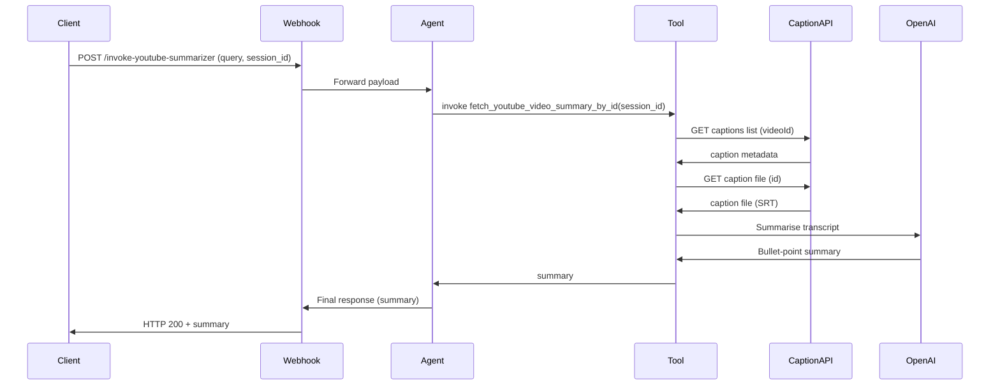

# YouTube Video Summarizer  

## Overview  
This workflow provides a **conversational AI assistant** that can generate concise, three‑bullet‑point summaries of YouTube videos. It works by:

1. Receiving a request (video URL or ID) via a secured webhook.  
2. Extracting the English caption track from the YouTube Data API.  
3. Downloading the caption file and converting it to plain text.  
4. Prompting OpenAI’s GPT‑4o‑mini model to summarise the transcript.  
5. Returning the summary to the caller and persisting a short “AI documentation” message in Supabase for audit purposes.  

The workflow solves the problem of **automatically summarising video content** without manual transcription, enabling downstream applications (chatbots, newsletters, etc.) to surface video insights quickly.

---

## Triggers and Entry Points  

| Node | Type | Trigger Details |
|------|------|-----------------|
| **Webhook** | `webhook` | HTTP **POST** on `/invoke-youtube-summarizer` (header‑based authentication). Receives JSON body with `query`, `user_id`, `request_id`, `session_id`. |
| **Execute Workflow Trigger** | `executeWorkflowTrigger` | Internal trigger used when the workflow is invoked as a **LangChain tool** (`Call n8n Workflow Tool`). It receives the same `session_id` from the AI Agent. |

> **Note** – The primary external entry point is the webhook; the internal trigger is only used by the AI Agent’s tool call.

---

## Inputs and Outputs  

### Input Payload (Webhook)  

| Field | Description |
|-------|-------------|
| `query` | YouTube video URL **or** ID (e.g., `https://www.youtube.com/watch?v=pC17ge_2n0Q`). |
| `user_id` | Identifier of the requesting user (OAuth provider ID). |
| `request_id` | Correlation ID for the request (for tracing). |
| `session_id` | Session identifier used for chat memory. |

### Output (Webhook Response)  

The **Respond to Webhook** node returns **all incoming items**, which include the AI Agent’s final response. The response contains a `summary` field (populated from the `Edit Fields1` node) when the tool execution succeeds.

---

## Node‑by‑Node Flow  

| # | Node | Type | Purpose | Key Settings |
|---|------|------|---------|--------------|
| 1 | **Webhook** | `webhook` | Entry point; validates header auth and parses request body. | Path: `invoke-youtube-summarizer`; Auth: `headerAuth`. |
| 2 | **Edit Fields** | `set` | Normalises incoming payload into flat fields (`query`, `user_id`, `request_id`, `session_id`). | Assigns each field from `$json.body.*`. |
| 3 | **AI Agent** | `langchain.agent` | Conversational agent that decides whether to call the summarisation tool. System message instructs it to pass only the video ID to the tool. | Prompt type: `define`; System message sets behaviour. |
| 4 | **Respond to Webhook** | `respondToWebhook` | Sends the agent’s final output back to the caller. | Adds custom header `X-n8n-Signature`. |
| 5 | **Postgres Chat Memory** | `langchain.memoryPostgresChat` | Persists and retrieves chat history for the given `session_id`. | Table: `messages`; Session key from `Edit Fields`. |
| 6 | **OpenAI Chat Model** | `langchain.lmChatOpenAi` | Provides the LLM used by the AI Agent for natural‑language reasoning. | Model: default (configured via credentials). |
| 7 | **Call n8n Workflow Tool** | `langchain.toolWorkflow` | Exposes this workflow as a LangChain tool (`fetch_youtube_video_summary_by_id`). When the agent invokes it, the **Execute Workflow Trigger** path runs. | Returns property `summary`. |
| 8 | **Execute Workflow Trigger** | `executeWorkflowTrigger` | Starts the caption‑processing sub‑workflow when the tool is called. | No extra config. |
| 9 | **Add AI Documentation Message to DB** | `supabase` | Inserts a placeholder AI message (`"-> Summarizing YouTube video..."`) into Supabase for audit/logging. | Table: `messages`; Fields: `session_id`, `message`. |
|10| **Retrieve Caption Data** | `httpRequest` | Calls **YouTube Captions List** endpoint to obtain caption metadata for the video ID. | URL: `https://www.googleapis.com/youtube/v3/captions`; Query: `videoId`, `part=snippet`. |
|11| **Find English Captions** | `set` | Filters the caption list to the first English (`en`) track using JMESPath. | Value: `$jmespath($json.items, "[?snippet.language == 'en'] | [0]")`. |
|12| **Download Captions** | `httpRequest` | Downloads the selected caption file (SRT/WEBVTT). | URL templated with `{{ $json.caption.id }}`. |
|13| **Caption File Conversion** | `extractFromFile` | Extracts plain‑text content from the downloaded caption file. | Destination key: `content`. |
|14| **Caption Summary with ChatGPT** | `langchain.openAi` | Sends the transcript (`content`) to OpenAI (model `gpt-4o-mini`) with a prompt to produce three bullet points. | Prompt: `Summarise this transcript into three bullet points …`. |
|15| **Edit Fields1** | `set` | Pulls the generated summary from the OpenAI response (`$json.message.content`) into a top‑level `summary` field for the tool’s return value. | Assigns `summary`. |

---

## Control Flow and Logic  

1. **Webhook → Edit Fields** – Normalises request data.  
2. **Edit Fields → AI Agent** – The agent receives the user query and decides whether to invoke the summarisation tool.  
3. **AI Agent** uses three sub‑connections:  
   * **Memory** → `Postgres Chat Memory` (maintains conversation context).  
   * **LLM** → `OpenAI Chat Model` (reasoning).  
   * **Tool** → `Call n8n Workflow Tool` (executes the caption‑processing sub‑workflow).  
4. **Tool Invocation** triggers **Execute Workflow Trigger**, which runs the caption pipeline (nodes 9‑15).  
5. The final summary is emitted from **Edit Fields1** as the tool’s `summary` property.  
6. The AI Agent incorporates that summary into its response, which is finally sent back via **Respond to Webhook**.  

All connections are **linear**; there are no conditional branches or loops defined in the JSON. Retries follow n8n’s default node‑level retry settings (not explicitly overridden).

---

## External Integrations  

| Integration | Nodes | Purpose |
|-------------|-------|---------|
| **YouTube Data API (OAuth2)** | `Retrieve Caption Data`, `Download Captions` | List caption tracks and download the selected English caption file. |
| **OpenAI API** | `OpenAI Chat Model`, `Caption Summary with ChatGPT` | Power the conversational agent and the transcript summarisation. |
| **PostgreSQL** | `Postgres Chat Memory` | Store and retrieve chat history per `session_id`. |
| **Supabase** | `Add AI Documentation Message to DB` | Log a “Summarising” message for auditability. |
| **Header Auth** | `Webhook` | Simple token‑based authentication for external callers. |

All credentials are referenced by ID (e.g., `youTubeOAuth2Api`, `openAiApi`, `postgres`, `supabaseApi`, `httpHeaderAuth`).  

---

## Error Handling and Retries  

* The workflow does **not** define custom error‑handling nodes.  
* n8n’s default behaviour applies:  
  * HTTP request nodes will retry on network errors according to the global retry settings.  
  * If any node throws an error, the execution stops and the webhook response will contain the error details (unless a separate error‑handling workflow is attached externally).  

**Recommendation** – Add `Error Trigger` nodes or `Set` nodes to capture and format errors for the caller.

---

## Configuration and Deployment Notes  

| Item | Details |
|------|---------|
| **Webhook URL** | `https://<your‑n8n‑host>/webhook/invoke-youtube-summarizer` (path defined in the Webhook node). |
| **Authentication** | Header token (`Authorization: Bearer <token>`). Token value is stored in the `Header Auth account` credential. |
| **YouTube OAuth2** | Uses the credential named **YouTube account Cole** – must have `https://www.googleapis.com/auth/youtube.force-ssl` scope. |
| **OpenAI** | Credential **OpenAi account** must have access to `gpt-4o-mini`. |
| **Postgres** | Credential **Prod Postgres account** must allow read/write on the `messages` table. |
| **Supabase** | Credential **Prod Supabase account** must allow inserts into the `messages` table. |
| **Execution Mode** | Set to **“v1”** (default) – nodes execute in the order defined by the connections. |
| **Versioning** | Workflow ID `pbIvEAU2iVZ0IoVi`; version stored in `versionId`. Deploy new versions by publishing a new workflow version in n8n. |

---

## Security and Data Protection  

* **Transport Security** – All external calls (Webhook, YouTube, OpenAI, Supabase, Postgres) should be made over HTTPS.  
* **Authentication** –  
  * Webhook uses a static bearer token (rotate regularly).  
  * YouTube OAuth2 token is managed by n8n’s credential store.  
  * OpenAI, Postgres, Supabase credentials are stored securely in n8n’s encrypted credential vault.  
* **Data Minimisation** – Only the English caption text is downloaded; no video content is stored.  
* **Retention** – Chat memory is persisted in PostgreSQL; consider TTL or manual cleanup for GDPR compliance.  
* **Logging** – The `Add AI Documentation Message to DB` node writes a minimal audit record; no raw transcript is stored in Supabase.  

---

## Limitations and Extension Points  

| Limitation | Impact | Possible Extension |
|------------|--------|--------------------|
| **English‑only captions** | Videos without an English track will fail at “Find English Captions”. | Add fallback to auto‑translate captions or use speech‑to‑text. |
| **Caption availability** | If a video has no captions, the workflow cannot summarise. | Integrate YouTube’s `autoGenerated` flag or a third‑party transcription service. |
| **Fixed prompt** | Summaries are always three bullet points. | Expose prompt as a configurable parameter (e.g., via webhook). |
| **No rate‑limiting** | High request volume may hit YouTube or OpenAI quotas. | Add a “Rate Limit” node or queue system. |
| **Single‑model usage** | Hard‑coded to `gpt-4o-mini`. | Parameterise model ID to allow cheaper or more capable models. |
| **Error handling** | Errors abort the workflow without graceful fallback. | Implement error‑catch nodes that return a friendly error message. |

---

## Visual Diagrams  

### Flowchart (main execution path)

```mermaid
flowchart TD
    A[Webhook] --> B[Edit Fields]
    B --> C[AI Agent]
    C -->|memory| D[Postgres Chat Memory]
    C -->|LLM| E[OpenAI Chat Model]
    C -->|tool| F[Call n8n Workflow Tool]
    F --> G[Execute Workflow Trigger]
    G --> H[Add AI Documentation Message to DB]
    H --> I[Retrieve Caption Data]
    I --> J[Find English Captions]
    J --> K[Download Captions]
    K --> L[Caption File Conversion]
    L --> M[Caption Summary with ChatGPT]
    M --> N[Edit Fields1 (summary)]
    N --> O[Return summary to tool]
    O --> C   %% tool result back to AI Agent
    C --> P[Respond to Webhook]
    P --> Q[Webhook Response]
```

### Sequence Diagram (key interactions)



--- 

*End of documentation.*